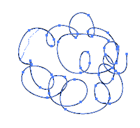
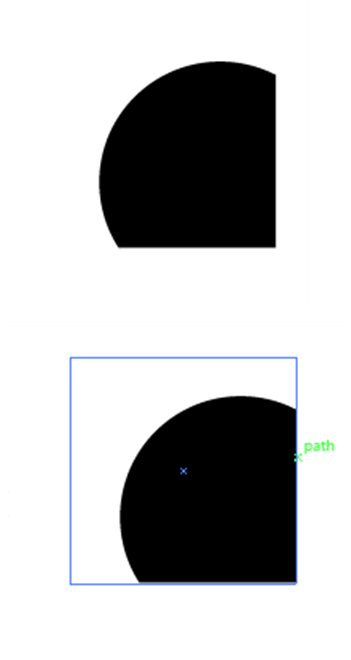

# Drawing

- [Table of contents](#drawing)
  * [Getting started](#getting-started)
    + [New document](#new-document)
    + [Editing vector documents](#editing-vector-documents)
    + [Exporting and saving:](#exporting-and-saving-)
    + [Drawing](#drawing-1)
      - [Pencil](#pencil)
      - [Brush](#brush)
      - [Pen](#pen)
      - [Shapes: Rectangle, ellipse, rounded rectangle, etc.](#shapes)
    + [Other](#other)
    + [Selection tools](#selection-tools)
    + [Image tracing](#image-tracing)

## Getting started
### New document
1.	Click on New from the File dropdown menu. 
2.	Select pre-set or modify dimensions. Name document. You can also select color mode in the advanced menu. Or modify it later on.  
3.	And there you go! 
 

[top](#drawing)

### Editing vector documents
1.  Right click on your PDF or postscript files. 
 

2.  Select the page from the document you want to edit. 
  

[top](#drawing)

### Exporting and saving:
1.	Click on File in the dropdown menu. 
  

2.  Save as an illustrator file (.ai) or as an encapuslated postscript file (.eps). 
3.  Export to other file types such as PDFs, TIFFs, etc.  

4.  Or, save as a JPEG or PNG using “Save for Web”.
  

[top](#drawing)

### Drawing
There are multiple drawing tools, each with unique properties, but mostly do similar things. 
Pencil is freeform drawing while pen draws (many connected) curves and lines. Lines draws only a single line. Brush is also freeform, but uses stylistic strokes (ie brushes).   
  

#### Pencil
- Freeform
  

- Edit anchor points (draw over)
  

#### Brush
- Freeform, but with style (ie brush strokes) 
  

#### Pen
- Draws lines (curved or straight) between anchor points. 
  

#### Shapes
- Rectangle, ellipse, rounded rectangle, etc. 
- Height and width depends on drag and release. But can force symmetry/locked ratio by dragging and holding shift.  

  

[top](#drawing)

### Other 
- Compound paths - make compound paths to merge different shapes/paths together
  

- Clipping masks - to hide parts of shapes/paths 
  

- Type objects - text 
 
Which can be converted to path objects by creating outlines
  
  

[top](#drawing)

### Selection tools 
- Direct select - selects individual paths, or anchor points 
  

- Select - selects whole path or group   
  

- Magic wand - selects similar objects. Modify the tolerance. 

- Or select objects based on properties like strokes, similar colors, weights, and appearances
  
  

[top](#drawing)

### Image tracing  
 

[top](#drawing)
 
 
 
 
Back to the [homepage](../README.md)

<small><i><a href='http://ecotrust-canada.github.io/markdown-toc/'>Table of contents generated with markdown-toc</a></i></small>
