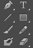
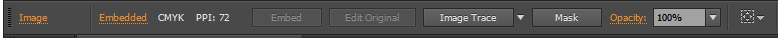

# Drawing

- [Table of contents](#drawing)
  * [Getting started](#getting-started)
    + [New document](#new-document)
    + [Editing vector documents](#editing-vector-documents)
    + [Exporting and saving](#exporting-and-saving-)
    + [Drawing](#drawing-1)
      - [Pencil](#pencil)
      - [Brush](#brush)
      - [Pen](#pen)
      - [Shapes: Rectangle, ellipse, rounded rectangle, etc.](#shapes)
    + [Other](#other)
    + [Selection tools](#selection-tools)
    + [Image tracing](#image-tracing)
-  Back to the [homepage](../README.md)

## Getting started
### New document
1.	Click on New from the File dropdown menu. 
2.	Select custom document size (eg A4) or modify dimensions to need. 
3. Name document. You can also select color mode in the advanced menu. Or modify it later on.  
  

[top](#drawing)

### Editing vector documents
1. Download the "load_into_illustrator.pdf" from the data folder (or click [here](../data/load_into_illustrator.pdf) and then click download). 
2. Right click on the PDF file (this works for postscript anf other vector files). 
  

3.  Select the page from the document you want to edit. Note, can only open one page at a time (and one version of the document).  
   

[top](#drawing)

### Exporting and saving
1.	Click on File in the dropdown menu. 
   

2.  Save as an illustrator file (.ai) or as an encapuslated postscript file (.eps). 
3.  Export to other file types such as PDFs, TIFFs, etc.  

4.  Or, save as a JPEG or PNG using “Save for Web” option.
5.  There, you can select the size, and type of file. 
  

[top](#drawing)

### Drawing
There are multiple drawing tools, each with unique properties, but mostly do similar things. 
Pencil is freeform drawing while pen draws (many connected) curves and lines. Lines draws only a single line. Brush is also freeform, but uses stylistic strokes (ie brushes).   
   

#### Pencil
- Freeform
   

- Edit anchor points (draw over)
   

#### Brush
- Freeform, but with style (ie brush strokes) 
   

#### Pen
- Draws lines (curved or straight) between anchor points. 
   

#### Shapes
- Rectangle, ellipse, rounded rectangle, etc. 
- Height and width depends on drag and release. But can force symmetry/locked ratio by dragging and holding shift.  

   

[top](#drawing)

### Other 
- Editing paths
- Editing points 
- Editing segments 

- Compound paths - make compound paths to merge different shapes/paths together
   

- Clipping masks - to hide parts of shapes/paths 
   

- Pathfinder - helps create compound shapes with more ease
   

- Type objects - text 
  
Which can be converted to path objects by creating outlines
   
   

[top](#drawing)

### Selection tools 
- Direct select - selects individual paths, or anchor points 
   

- Select - selects whole path or group   
   

- Magic wand - selects similar objects. Modify the tolerance. 
 

- Or select objects based on properties like strokes, similar colors, weights, and appearances
   
   

[top](#drawing)

### Image tracing  
Download this [image](../data/paste_into_illustrator.png) or copy one of interest.   
#### Manual 
- Paste image onto artboard (or drag and dropw). Using the pencil (or pen), slowly trace around the part of the figure you want. 
- This is tedious, but can work for small things. 
   
#### Tracer
- Paste image onto artboard and select the image. 
 
- Different tracing options allow for fun objects. 
   
   

[top](#drawing)
 
 
 
 
Back to the [homepage](../README.md)

<small><i><a href='http://ecotrust-canada.github.io/markdown-toc/'>Table of contents generated with markdown-toc</a></i></small>
