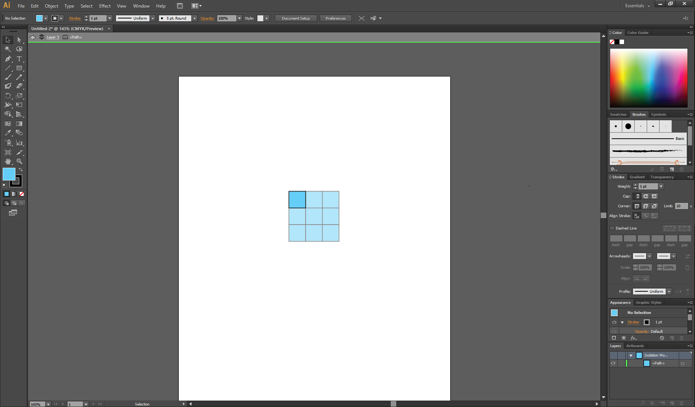

# Ya basics

- [Table of contents](#intro)
  * [Getting to know your workspace](#getting-to-know-your-workspace)
  * [Menu bar](#menu-bar)
  * [Definitions](#definitions)
  * [Tools toolbar](#tools-toolbar)
  * [Properties sidebar](#properties-sidebar)
  * [Control bar](#control-bar)
    
## Getting to know your workspace
 
- Left side bar – tools
- Right side bar – properties 
- Top bar – control bar 

## Menu bar
- View menu – appearance of workspace 
 

- Window menu – what tool bars to show 
 

## Definitions 
- Artboard - where you draw. Saves/prints within the artboard. Can be manipulated/changed, duplicated. 
 

- Drawings - Graphics are vectors (mostly, can paste in non-vector graphics). Drawn in coordinate space (x and y). 
- Paths – series of points, connected. 
- Lines drawn between the points can be straight or curves. 
- Anchors – points, connected by lines. Anchors help define the curvature of the lines. 
- Handles – one way to control the curvature (bezier curves) of lines, and are defined by their length and angle. 
 

- Layers - part of the workspace where your objects sit. Multiple layers on an artboard. 
- Useful to organize and control visibility of objects.  
 

- Groups - multiple paths grouped. 
- Note - cannot group across layers (group gets transferred to top layer).
 

- Type - text is a different class of object. Can be modified/edited mostly the same as other objects. 
 

- Can also convert it to a path but then you lose the ability to edit. 
 

## Tools toolbar
- Tools - drawing and manipulation tools. 
- Most functions are easy to guess from their icons. 
Hover over to get name and shortcut. 
- Selection tools grouped together at top. 
- Followed by drawing tools, and then manipulation/effect tools.  
 

- Hidden tools can be accessed by holding down on tools with a little triangle in the bottom corner. 
 

- Tool options can be modified/accessed by double clicking (most tools have this). 
 

## Properties sidebar
- Many effects and properties (fun sidebar). 
- Main/most useful are: 
- Color
 

- Effects such as strokes, gradients, transparency 
 

- Layers, artboards, actions, appearances, etc. 

## Control bar 
- Edit properties for single or multiple paths/edges. Changes depending on the object you've selected.
- Paths
 

- Anchor points 
 

- Type 
 

- Can also be used to manipulate the position of the object and its width precisely using coordinates, or align relative to other objects 
 

 
Back to the [homepage](../README.md)
<small><i><a href='http://ecotrust-canada.github.io/markdown-toc/'>Table of contents generated with markdown-toc</a></i></small>

